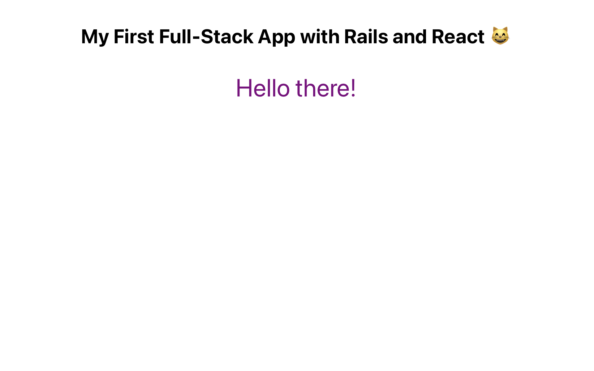

<div align="center">
<h1>Hello React Frontend</h1>
</div>

<div align="center">
 
 
 
 
 
 
 
</div>

<br>

<p align="center">This app loads a different greeting message every time you reload the page. It's an academic project meant to help me understand how to build two separate apps for the backend and the frontend. It was bootstrapped with <a href="https://github.com/facebook/create-react-app">Create React App</a>, using the <a href="https://redux.js.org/">Redux</a> and <a href="https://redux-toolkit.js.org/">Redux Toolkit</a> template. Calls are made to another app I built with Rails.</p>

<br>

<div align="center">
</div>

## About
This app shows a different greeting message when you refresh the page. Redux handles the global state of the app.

The page consumes an API I built with Ruby on Rails located [here](https://hello-rails-backend.herokuapp.com) ([Github repo here](https://github.com/StarSheriff2/hello-rails-back-end)).

### Features:
- See a random Greeting message everytime you refresh the page.

### Live Demo

Deployed to Netlify: [Live Demo](https://hello-react-frontend.netlify.app)

### Built With
- HTML, CSS, JavaScript
- sass 1.38.0
- NPM 7.18.1
- Axios 0.23.0
- Reduxjs/toolkit 1.5.1
- react 17.0.2
- react-redux 7.2.3
- react-router-dom 5.3.0
- redux-logger 3.0.6
- react-devtools 4.19.2
- Netlify
- Linters: ESLint, Stylint
- VS Code

### About the API

- This app consumes a Ruby on Rails API. The API documentation is available [here](https://hello-rails-backend.herokuapp.com/api-docs/index.html).

- The app calls the API on one single endpoint: `/api/v1/random-greeting`

## Getting Started

To get a local copy up and running, follow these simple example steps.

### Prerequisites
- A browser to open the main file
- Node.js
- NPM
- Yarn

### Get files
1. Open your terminal or command prompt.
2. If you do not have git installed in your system, skip this step and go to step 3; otherwise, go to the directory where you want to copy the project files and clone it by copying this text into your command prompt/terminal:
```
git clone git@github.com:StarSheriff2/hello-react-front-end.git
```
<br>Now go to the ***"Install Dependencies"*** section.

3. Download the program files by clicking on the green button that says “**Code**” on the upper right side of the project frame.
4. You will see a dropdown menu. Click on “**Download ZIP**.”
5. Go to the directory where you downloaded the **ZIP file** and open it. Extract its contents to any directory you want in your system.

### Install Dependencies
1. Go to the root directory of the project
2. In your command line, while in the root dir, type `npm install`. It will install all necessary dependencies in your project files
3. Now type `yarn start` or `npm run start`. It will load the project in your default browser.<br><br>
**Note:<br>_This command will not stop on its own. If you change something in your project files, it will recompile and reload the page in your browser. To exit, hit "ctrl + c"_**

## Development

### Bundle project

- `yarn build`

### Linters
To run the linters included in this repository, go to the root directory of your repository and copy/paste the following commands into your terminal:
(**Note:** Make sure you run `npm install` before you do this)
- for ESlint, `npx eslint.`
- for Stylelint, `npx stylelint "**/*.{css,scss}"`

### Devtools
To use dev tools run `yarn redux-devtools` before starting your local server locally

### All Available Scripts

<details>
 <summary>In the project directory, you can run:</summary>

### `yarn start`

Runs the app in the development mode.\
Open [http://localhost:3000](http://localhost:3000) to view it in the browser.

The page will reload if you make edits.\
You will also see any lint warnings in the console.

### `yarn build`

Builds the app for production to the `build` folder.\
It correctly bundles React in production mode and optimizes the build for the best performance.

The build is minified and the filenames include the hashes.\
Your app is ready to be deployed!

See the section about [deployment](https://facebook.github.io/create-react-app/docs/deployment) for more information.

### `yarn eject`

**Note: this is a one-way operation. Once you `eject`, you can’t go back!**

If you aren’t satisfied with the build tool and configuration choices, you can `eject` at any time. This command will remove the single build dependency from your project.

Instead, it will copy all the configuration files and the transitive dependencies (webpack, Babel, ESLint, etc) right into your project so you have full control over them. All of the commands except `eject` will still work, but they will point to the copied scripts so you can tweak them. At this point, you’re on your own.

You don’t have to ever use `eject`. The curated feature set is suitable for small and middle deployments, and you shouldn’t feel obligated to use this feature. However, we understand that this tool wouldn’t be useful if you couldn’t customize it when you are ready for it.
</details>

## Usage

1. In your terminal, run <code>yarn start</code>. This command will run the app in the development mode and open a new tab in your browser.
2. Refresh the page to see a different greeting message! 😸

## Author
👤 **Arturo Alvarez**
- Github: [@StarSheriff2](https://github.com/StarSheriff2)
- Twitter: [@ArturoAlvarezV](https://twitter.com/ArturoAlvarezV)
- Linkedin: [Arturo Alvarez](https://www.linkedin.com/in/arturoalvarezv/)

## 🤝 Contributing

Contributions, issues, and feature requests are welcome!

Feel free to check the [issues page](https://github.com/StarSheriff2/hello-react-front-end/issues).

## Show your support

Give a ⭐️ if you like this project!

## 📝 License

This project is [MIT](https://github.com/StarSheriff2/GNI-per-Capita-in-the-World/blob/development/LICENSE) licensed.
